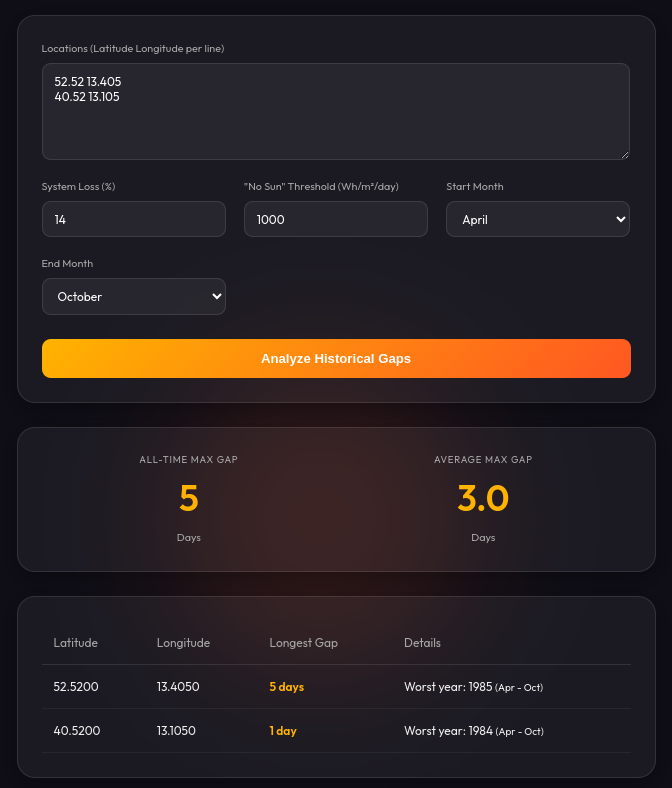

# Solar Gap Analysis

Historical max consecutive "no-sun" days based on NASA POWER data (1984-2024).

## How to use this tool:

1. **Enter your latitude and longitude**: You can enter multiple locations, one per line. Use either spaces or commas between the coordinates.
2. **Enter your system loss percentage**: (TOTAL Solar System Loss including: PV, inverter, cables, battery, etc.)
3. **Enter your "no-sun" threshold (Wh/m²/day)**: This is the threshold below which a day is considered "no-sun" and the inverter will fail to function.
4. **Click "Analyze Historical Gaps"**: The tool will fetch up to 40 years of daily data from NASA for each location provided.
5. **View the results**: The tool will show the longest consecutive "no-sun" gap found across all years for each location and the year it occurred. Copy this and paste into your spreadsheet.

## The client report

- Get the max device power requirements (Wh/m²/day) (Name: DevWh)
    - This dictates the min size of the battery and the min W/h the PV must supply
- Get the min power produced by the PV system in your location (Wh/m²/day) (EC histogram)
    - The min power should include system losses
    - If you are running a split system (east/west), run the analysis for each azimuth separately and then take the minimum of the two.
- Get the max consecutive "no-sun" days in your location (Name: MaxGap)
    - Min battery size = MaxGap * DevWh
    
